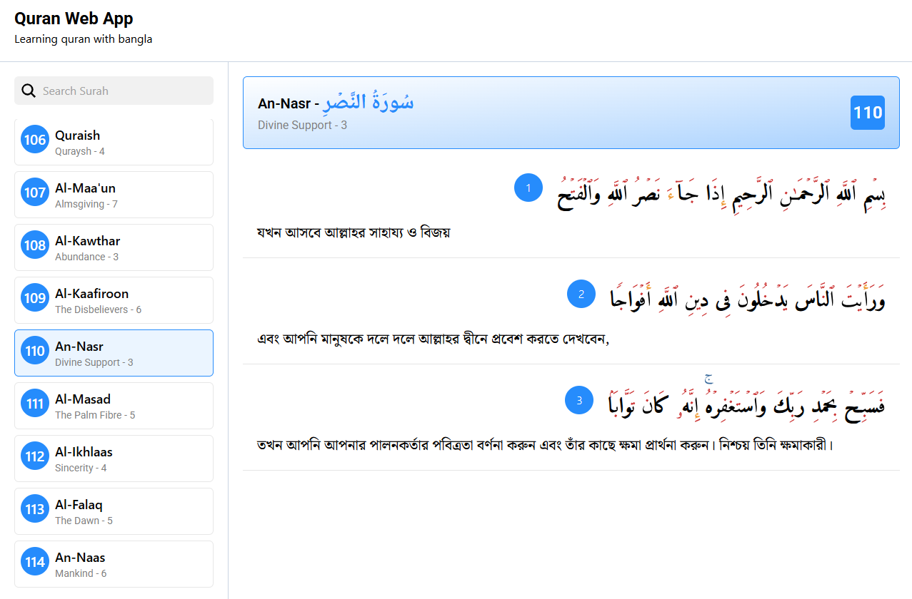
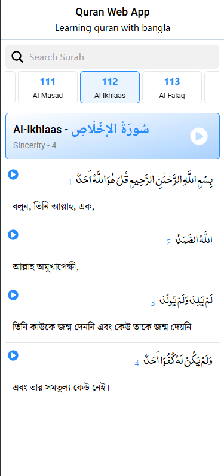

# AQuran Bangla Web App

This is a complete Quran reading web application built using **React.js**. You can browse all Surahs, filter Surahs by number, read Arabic verses with Bangla (Bengali) translation, and listen to audio for each Surah and Ayah.

## Live Demo

👉 [https://alquran-bangla-web-app.vercel.app/]

## Features

✅ Load all Surahs  
✅ Filter Surahs by Surah number  
✅ Display each Ayah in Arabic  
✅ Show Bangla translation for each Ayah  
✅ Play full Surah audio  
✅ Play individual Ayah audio  

## Technologies Used

- **React.js**
- **Tailwind CSS** (if used)
- **AlQuran Cloud API**: [https://alquran.cloud/api](https://alquran.cloud/api)

## API Source

This app uses the following API:  
🔗 https://alquran.cloud/api

## Screenshots

   ### Web View
<a href="https://vercel.com/promahbubuls-projects/alquran-bangla-web-app"></a>

   ### Mobile View
<a href="https://vercel.com/promahbubuls-projects/alquran-bangla-web-app"></a>

## Installation Guide

To run this project locally, follow these steps:

```bash
git clone https://github.com/promahbubul/Quran_Bangla_Web_App
cd Quran_Bangla_Web_App
pnpm install
pnpm run dev
```